# 🔐 Real-Time Transaction Fraud Detection System with Power BI Dashboards

## 🔍 Project Overview

This project delivers a complete machine learning pipeline for real-time transaction fraud detection. It combines predictive modeling, RESTful API services, database storage, and dynamic visualization using Power BI — offering a production-ready framework for financial fraud prevention.

### This system features:
- A scalable Flask API for real-time predictions
- MySQL integration for transaction log persistence
- Interactive Power BI dashboards (local) for fraud insight
- A web-based UI hosted on Render for manual testing
- GridSearchCV-tuned machine learning models for performance

---

## 🚀 Key Features

- 🔗 Real-time classification of fraudulent transactions
- 🧠 Hyperparameter optimization using GridSearchCV
- 💾 Local MySQL database to track transaction logs
- 📊 Power BI dashboard connected to live database
- 🌐 Simple web interface for user-submitted transactions
- 📮 REST API support, verified using Postman
- 📁 Clean, modular structure for easy understanding and deployment

---

## 📁 Folder Structure

```
📁 eal-Time-Transaction-Fraud-Detection-System-with-Power-BI-Dashboards/
├── app.py                        # Main Flask app with UI and prediction endpoint
├── appsql.py                     # Alternate Flask app with MySQL logging integration
├── config.py                     # Database connection configuration (MySQL)
│
├── sql/                          # SQL scripts for database setup
│   ├── create_table.sql          # Creates fraud_transactions table
│   └── data.sql                  # Sample data insertion script
│
├── models/                       # Pre-trained and serialized machine learning models
│   ├── best_fraud_detection_model.pkl
│   └── best_fraud_detection_pipeline1.1.pkl.bz2
│
├── notebooks/                    # Jupyter Notebooks for model development
│   ├── TryFinal.ipynb            # Model training and evaluation pipeline
│   └── TryFinalTunning.ipynb     # Hyperparameter tuning using GridSearchCV
│
├── templates/                    # Frontend templates for Flask (HTML)
│   └── index.html                # UI for manual transaction input
│
├── images/                       # Visual assets and screenshots
│   ├── 1.png                     # Homepage UI preview
│   ├── 2.png                     # About page preview
│   ├── flow_diagram.png          # System architecture flowchart
│   ├── postman_test.png          # Postman request/response example
│   ├── mysql_connection.png      # MySQL-Power BI setup screenshot
│   ├── powerbi_mysql.png         # Power BI table data preview
│   ├── transaction_overview.png  # Dashboard: Transaction Summary
│   ├── demographic_insights.png  # Dashboard: Demographics
│   ├── geographic_analysis.png   # Dashboard: Regional Fraud Analysis
│   ├── merchant_category.png     # Dashboard: Merchant Category Breakdown
│   └── temporal_analysis.png     # Dashboard: Temporal Fraud Trends
│
├── requirements.txt              # Python dependencies for the project
├── Projectppt.pptx               # Final project presentation slide deck
└── README.md                     # Project documentation

```

---

## 🔧 Setup & Installation

### 1. Clone Repository
```bash
git clone https://github.com/noumannahmad/Real-Time-Transaction-Fraud-Detection-System-with-Power-BI-Dashboards.git
cd Real-Time-Transaction-Fraud-Detection-System-with-Power-BI-Dashboards
```

### 2. Install Dependencies
```bash
pip install -r requirements.txt
```

### 3. Configure MySQL
Update `config.py` as shown:
```pythonDB_CONFIG = {
    'host': 'localhost',
    'user': 'root',
    'password': '1978',
    'database': 'fraud',
    'port': 3310,  # Updated port
    'auth_plugin': 'mysql_native_password'
}
```

### 4. Initialize Database
Run the following commands:
```bash
mysql -u root -p < sql/create_table.sql
mysql -u root -p < sql/data.sql
```

### 5. Run the Flask App
```bash
python app.py
```
Visit: [http://127.0.0.1:5000](http://127.0.0.1:5000)

---
## Live Preview Links

### PowerBi Live Preview: [Click Here](https://app.fabric.microsoft.com/view?r=eyJrIjoiZjhkMTVmMzUtNDJkOC00OGVlLTkzMDYtYzFiYWM4OWExMzI2IiwidCI6ImRhYTU5MmNhLWRlN2ItNGM1NC04ODM2LTkxYTY2OTBmZTE5NyJ9&pageName=227861ced3fd2f726a2c)
### Novypro Live Preview: [Click Here](https://www.novypro.com/create_project/credit-card-fraud-detection%F0%9F%92%B3)
### Ui Live Preview: [Click Here](https://credit-card-fraud-detection-gnkn.onrender.com/)

## 📊 Dashboards (Local Power BI)

Power BI is used **locally** to visualize fraud data from MySQL.

Steps:
1. Open Power BI Desktop → "Get Data" → "MySQL"
2. Enter your MySQL credentials
3. Select the `fraud_transactions` table
4. Build visuals such as:
   - Count of fraud vs non-fraud transactions
   - Demographic-based filtering
   - Fraud trends by date/time
   - Merchant category fraud reports

---

## 🧪 API Testing

Use **Postman** to send test requests:
```json
POST http://127.0.0.1:5000/predict
{
 "amt": 281.06,
  "city_pop": 885,
  "lat": 35.9946,
  "long": -81.7266,
  "merch_lat": 36.430124,
  "merch_long": -81.179483,
  "unix_time": 1325466397,
  "category":"grocery_pos"
}
```

To confirm data is being logged, run:
```sql
SELECT * FROM fraud_transactions;
```

You’ll see real-time logs of each prediction made by the model.

---

## 🖼️ Visuals

**📊 System Flow Diagram**  
Shows data flow from user to model to MySQL to Power BI.  
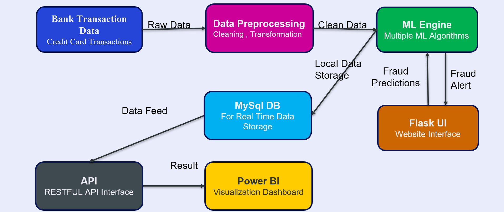

**📮 Postman API Test**  
Sample request and successful JSON response.  
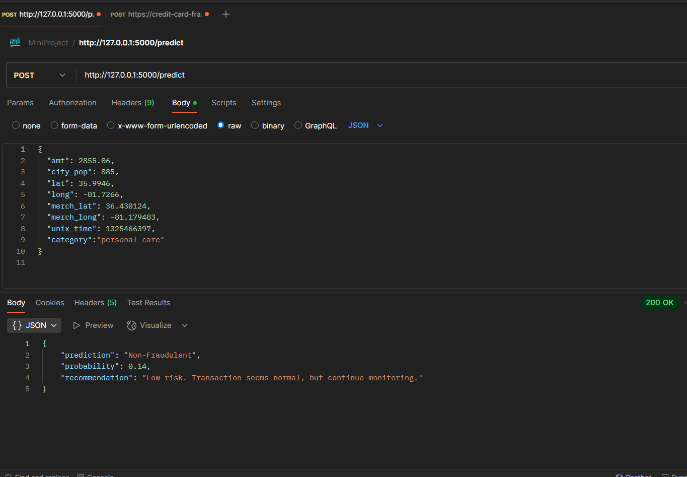

**🔌 MySQL - Connection Setup (Power BI)**  
How the database is linked with Power BI.  
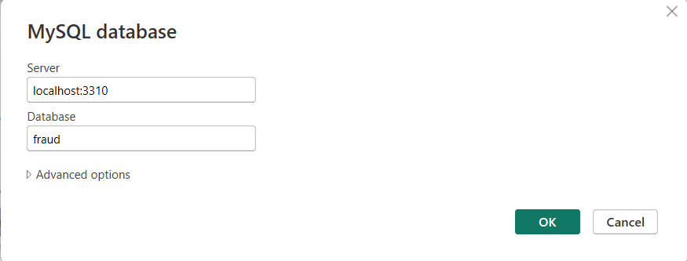

**📈 Power BI - MySQL Table View**  
Fraud logs live in Power BI dashboards.  
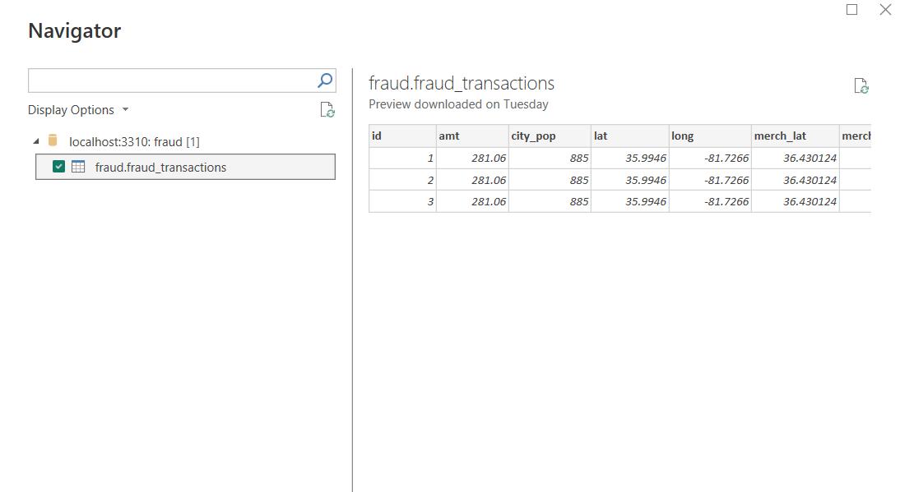

**🖥️ Flask UI - Home**  
User interface for entering transaction data.  
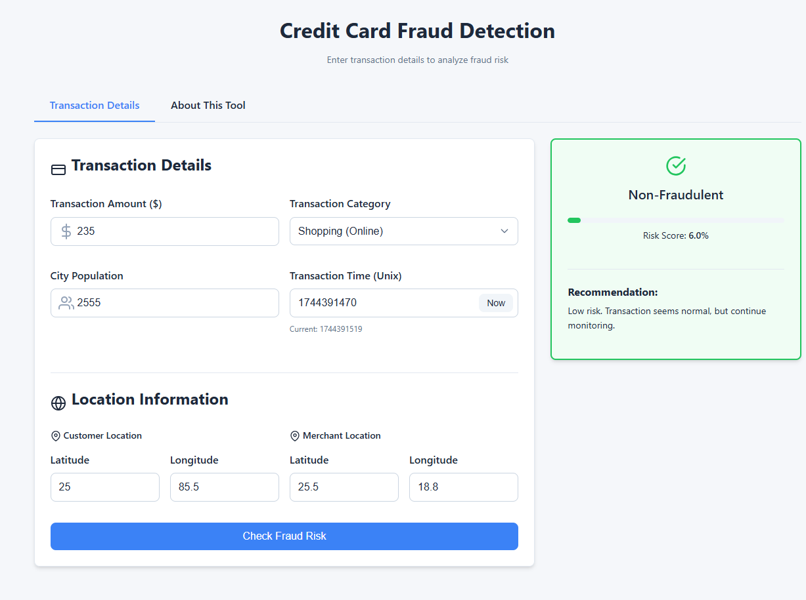

**🧾 Flask UI - About**  
Describes the app functionality.  
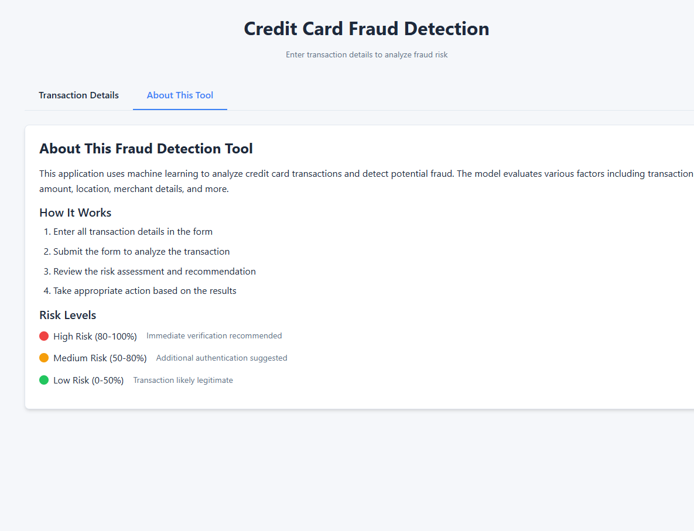

**💹 Transaction Overview**  
Fraud vs Legit overview.  
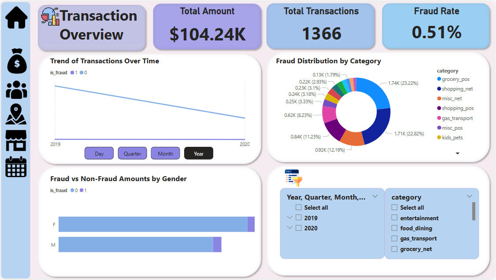

**🧍 Demographic Insights**  
Gender, age-based fraud ratios.  
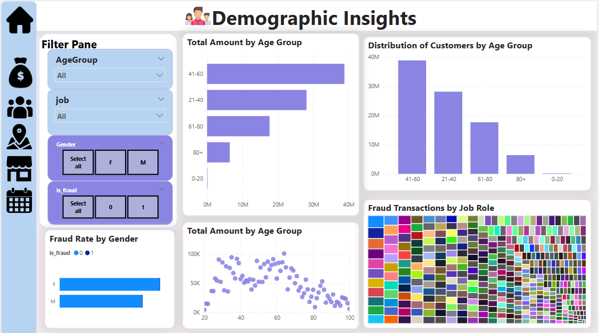

**🗺️ Geographic Analysis**  
Region-wise fraud spread.  
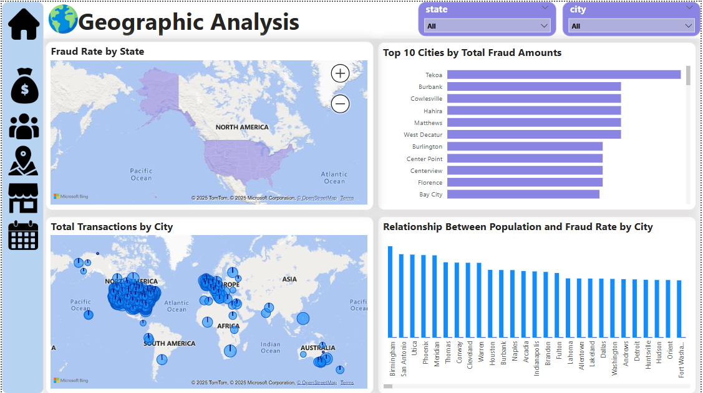

**🏪 Merchant Category Analysis**  
Which merchants are more targeted.  
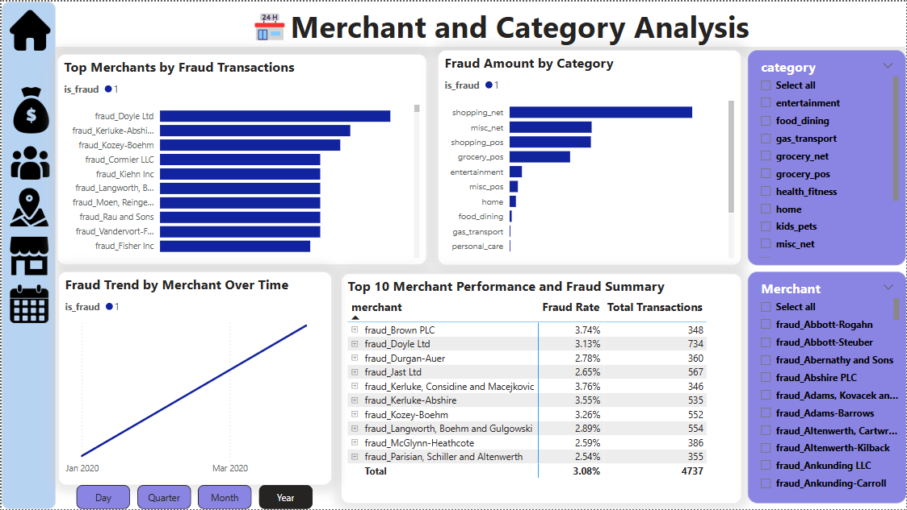

**⏱️ Temporal Analysis**  
Fraud rate vs time of day/week.  
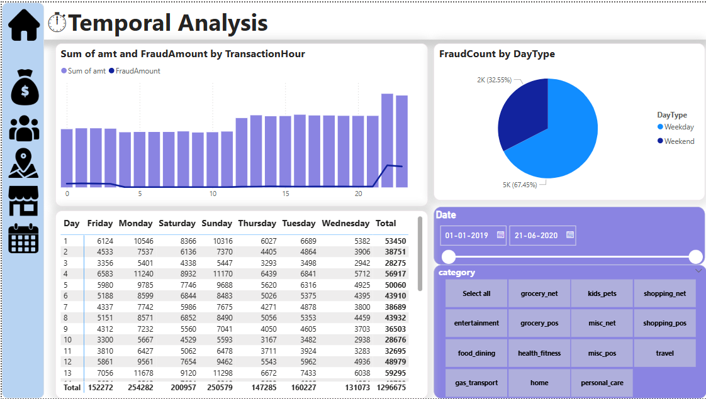

---

## 📈 Model Performance

| Metric      | Score    |
|-------------|----------|
| Accuracy    | 0.9959   |
| ROC-AUC     | 0.9920   |
| Precision   | 0.9990   |
| Recall      | 0.9969   |
| F1-Score    | **0.9979** |

> Model: Random Forest with balanced class weights and 200 trees.

---

## 📜 License
Apache 2.0 — You’re free to use, modify, and distribute with attribution.


